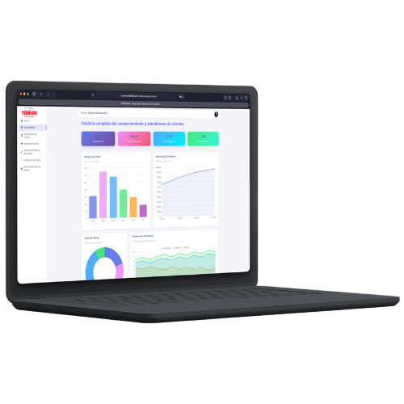

## About TOXILAB-BI



<b>TOXILAB-BI</b> is an application used for the decision making process of clinical laboratories. It includes integrated chat to generate informative reports by querying the database with the help of artificial intelligence through Google APIs.

## Installation

#### 1. Clone the repository

```sh
git clone git@github.com:alfargenis/toxilab-bi.git
```

#### 2. Copy .env

```sh
cp .env.example .env
```

#### 3. Configure .env

```sh
GEMINIS_API_KEY=YOUR_API_KEY

```

#### 4. Install depedencies

```sh
composer install
```

#### 5. Generate Key

```sh
php artisan key:generate
```

#### 6. Run Symlink

```sh
php artisan storage:link
```

#### 7. Migrate database

```sh
php artisan migrate
```

#### 8. Database seeders

```sh
php artisan db:seed
```

#### 9. Reset antrian every day with cron job

```sh
php artisan schedule:work
```

#### 10. Run application

```sh
php artisan serve
```
#### <i><b>Note. username: admin & password: @Admin123</b></i>